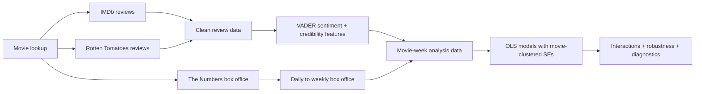
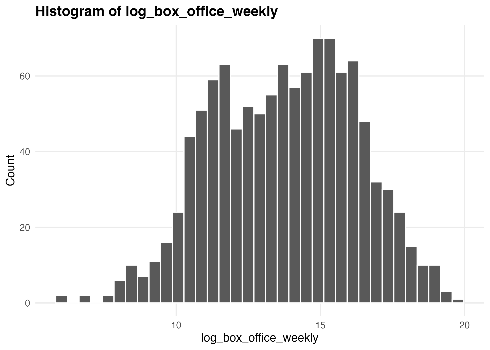
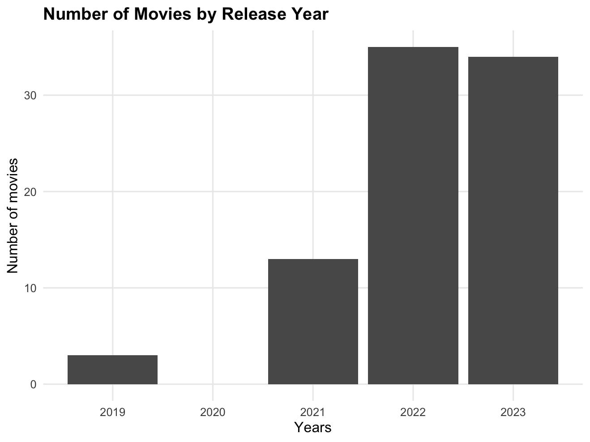

# Online Movie Reviews and Box Office Performance

This project comes from my MSc thesis in Marketing Analytics and Data Science. I built a multi-source dataset to examine how online movie reviews are associated with weekly domestic box office performance, using data from IMDb, Rotten Tomatoes and The Numbers.

The project combines **Python web scraping**, **text analysis**, **data cleaning**, **R**, and **regression modelling**. The final thesis sample contains **85 movies and 1,119 movie-week observations**.

## Project at a glance

| | |
| --- | --- |
| **Question** | How are review sentiment, disagreement, volume and credibility associated with weekly box office performance? |
| **Data sources** | IMDb, Rotten Tomatoes, The Numbers |
| **Python** | Playwright, BeautifulSoup, pandas |
| **R** | dplyr, VADER sentiment, OLS, clustered standard errors, diagnostics |
| **Unit of analysis** | Movie-week |
| **Final sample** | 85 movies, 1,119 movie-week observations |

## What I found

The clearest result in the original thesis models was that **review volume had the most consistent positive association with weekly box office on both platforms**. Average sentiment was positive but not statistically significant in the main-effects models, and sentiment variance was not a robust direct predictor.

Credibility was more interesting when it interacted with other review characteristics. On IMDb, the relationship between positive sentiment and box office was stronger when reviews had higher helpfulness. On Rotten Tomatoes, the relationship between review volume and box office was stronger when a larger share of audience reviews was verified.

The broader takeaway for me was that the same review metric does not necessarily behave the same way across platforms. Platform design and credibility signals matter when interpreting online review data.

Because the data are observational, I treat these results as **associations rather than causal effects**.

## How I built the project

I used a movie lookup table with IMDb IDs to keep titles aligned across the different sources. Python notebooks were used to collect review and box-office data, while the main cleaning, feature construction and statistical analysis were carried out in R.



For review text, I used VADER compound scores to calculate average sentiment and sentiment variance by movie. IMDb credibility was based on review helpfulness, while Rotten Tomatoes credibility was based on the share of verified audience reviews. Daily box office was aggregated into weeks since release.

The regression models control for release timing, production budget, genre and release season. Standard errors are clustered at movie level because each movie contributes multiple weekly observations.

## A couple of useful checks

Weekly box office was strongly right-skewed, so I used its natural logarithm in the main models.



The sample is concentrated in the later years of the study period.



Residual and Q-Q plots are also included in `visuals/` to document the model diagnostics.

## Repository structure

```text
.
├── analysis/
│   ├── 01_prepare_review_and_box_office_data.R
│   ├── 02_run_thesis_models.R
│   └── ANALYSIS_NOTES.md
├── scraping/
│   ├── imdb_reviews.ipynb
│   ├── rotten_tomatoes_reviews.ipynb
│   ├── daily_box_office.ipynb
│   └── README.md
├── data/
│   └── README.md
├── visuals/
├── requirements.txt
└── R-packages.txt
```

`01_prepare_review_and_box_office_data.R` contains the data-preparation steps I can still trace from the retained source files. `02_run_thesis_models.R` starts from the archived final thesis dataset and reproduces the model specifications, interaction models, robustness checks and diagnostics.

## Reproducibility and data notes

The repository does **not** include raw review text, reviewer identifiers, daily box-office extracts or other third-party source datasets. The scraping notebooks are cleaned versions of the historical code I used for the thesis. I have not tested them against the current websites, so they should be read as documentation of the original collection process rather than maintained scraping tools.

I also no longer have a reliable record of how the separate historical review-volume source file was collected. I therefore do not publish or recreate that extraction step. The original thesis variables are preserved in the private archived analysis dataset rather than giving them a provenance I cannot verify.

The raw review extracts also contain some duplicate rows. The preparation script reports the duplicates but does not silently remove them, because deduplication was not part of the retained thesis analysis.

## What I would improve now

The main thing I would change is the time alignment of the review features. In the thesis implementation, review characteristics are aggregated at movie level and then joined to weekly box office observations. This means that reviews posted later in a movie's run can contribute to a feature attached to an earlier box-office week.

A stronger follow-up analysis would rebuild the review variables cumulatively by week, so each movie-week only uses reviews available up to that point. I would also separate re-release periods from the initial theatrical run more explicitly. That would make the temporal interpretation cleaner without changing what the original thesis actually did.

## Running the code

The Python notebooks use the packages in `requirements.txt`. The R scripts use the packages listed in `R-packages.txt`. The analysis expects private source files under `data/private/`, which is intentionally excluded from version control.

The public repository is mainly intended to show the workflow, analysis and modelling decisions without redistributing the underlying third-party datasets.
